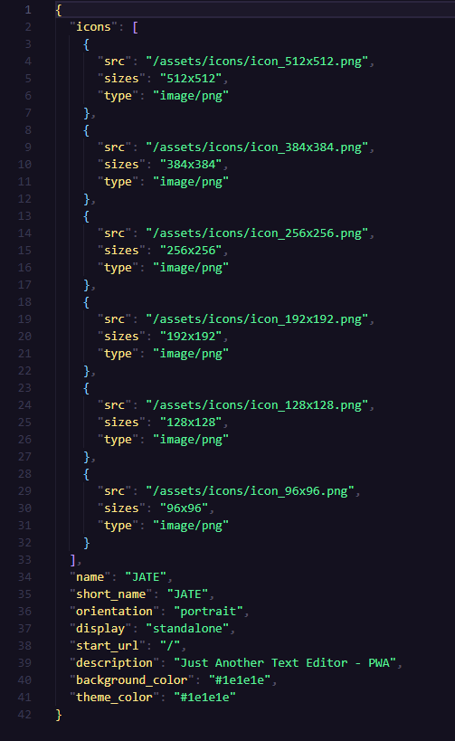

# Text-Editor-PWA

## Description

This is an in-browser PWA that serves as a single-page Text Editor. It utilizes webpack bundling, service workers, and IndexedDB to implement data persistent techniques. This application is also intended to function offline. 

## Adversity

## Installation

## Usage

## Screenshots

manifest.JSON ↓ 

## Credits

Developed By: github.com/jaqsentanner

## License

MIT License
